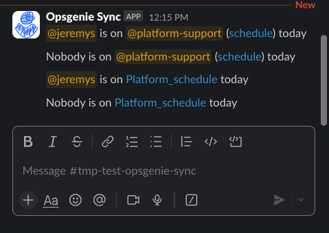

# Opsgenie Slack Sync
## What it Does
Sends daily messages like the below:



And can update slack group membership to match:


## How it Works
Internally, it checks a list of Opsgenie support schedules, and for each one will:
- Message chat with who is on support (if chat channel provided)
- Updates slack user group to whoever is on support (if user group provided)

The message allows a team internally to stay up to date with who's on support, and the user group gives all other teams a stable @squad_support handle to alert and get help from the squad's support person that day.
## Setup for Squad
### Requirements
You need 3 things:
- Squad Opsgenie support schedule
- Slack chat to send messages to
	- Optional, if not provided, no messages
- Slack group to update membership of
	- Optional, if not provided doesn't update group

**1. Get Opsgenie Schedule**

Copy paste your schedule name from Opsgenie's [All schedules page](https://constantinople.app.opsgenie.com/settings/schedule/schedule-list)

**2. Get slack channel ID**

*Optional, this is only if you want messages for who's on support*
Easiest way is to right click chat, copy chat link, take the ID from the end e.g. #squad-platform has the ID `C05HVGL6CF5` and link

You can use channel name, but that is slow as incurs a large paginated search behind the scenes. Use channel ID.

https://constantinoplehq.slack.com/archives/C05HVGL6CF5

**3. Add Opsgenie Sync bot to chat**

In the chat type `@Opsgenie Sync`, send and add to channel

**3. Setup Support group**

*Optional, this is only if you want a @support_group handle to tag your person on support*
[Create a user group | Slack](https://slack.com/intl/en-au/help/articles/212906697-Create-a-user-group)

### Adding to Bot
under `index.ts` add a new stanza to `RosterSlackMappings`, e.g.:
```ts
import { syncSlackWithOpsgenie, type ScheduleToSlackGroupChannel } from "./src/syncOpsgenieSlack.js";

const RosterSlackMappings: ScheduleToSlackGroupChannel[] = [
  // Actual Platform squad alerting. Sends message and updates support group
  {
    opsgenieScheduleName: 'Platform_schedule',
    // slackChannelName: 'squad-platform', // Can be provided, but expensive paginated API call. Use Channel ID instead
    slackChannelId: 'C05MD9Y10P9',
    slackGroupName: 'Platform Support',
  },
  // Example Squad1 only update group membership
  {
    opsgenieScheduleName: 'Squad1schedule',
    slackGroupName: 'Squad1 Roster',
  },
  // Example squad2 only send message to channel
  {
    opsgenieScheduleName: 'Squad2 - Operations Schedule',
    slackChannelId: 'C084X18A92N', // Sends to #tmp-test-opsgenie-sync,
  },
  // INSERT YOUR SQUAD STANZA HERE
  // ...
]

await syncSlackWithOpsgenie(RosterSlackMappings);
```
### Redeploy
TODO: CICD it, current approach is ew. But what you do is:
 
1. `npm run build`
2. upload `dist/lambda.zip` to the lambda (ask jez)

DON'T run locally with `npm run run:sync`, this'll spam slack. Have disabled local run fully, but can be done by just adding the function in the lambda handler to local one. 